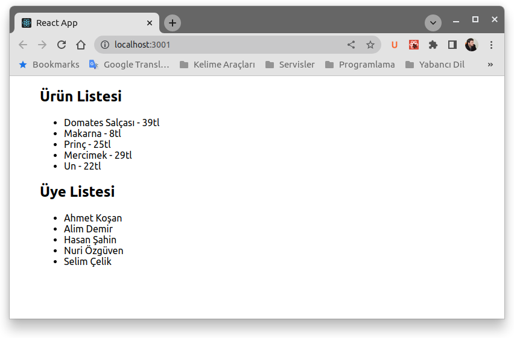

# React JS Array.map Kullanımı

Array.map metodu diziler üzerinde işlem yaparken çok kullandığımız bir metoddur. Bu metodu React JS ile geliştirme yaparken de çok kullanmaktayız. Özellikle liste şeklindeki verileri ekrana basmak için **map** metodunu kullanıyoruz. 


Bu yazımızda [Netbilio](https://netbilio.com) üzerinde yayınladığımız [ReactJS Map Metodunu Kullanma](https://netbilio.com/reactjs-map-kullanimi/) yazımızdaki örnekleri bulunduruyoruz. 

İki farklı komponent oluşturduk. **UrunListele** isimli komponentimizde bir ürün listesini ekrana bastık. İkinci komponentimizde elimizde bir üye listesi var ve bu üye isimlerini ekrana basıyoruz.

Repoyu bilgisayarınıza indirdikten sonra, react-map klasörü içerisine girin ve ```npm init``` komutunu çalıştırın. Gerekli paketler kurulduktan sonra ```npm start``` komutu ile uygulamayı ayağa kaldırabilirsiniz. Sisteminizde **Node JS** ve **npm** paket yöneticisi kurulu olmalıdır.



[Konunun açıklamasını ilgili sayfadan bakabilirsiniz.](https://netbilio.com/reactjs-map-kullanimi/)